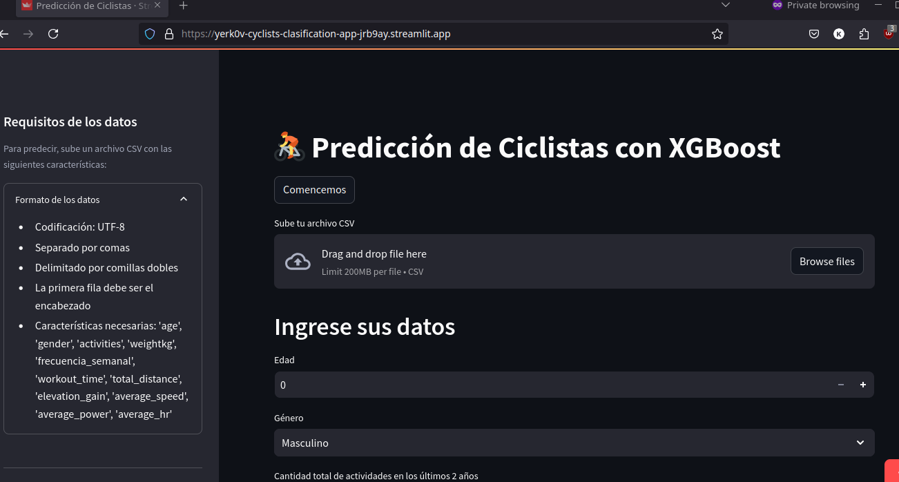
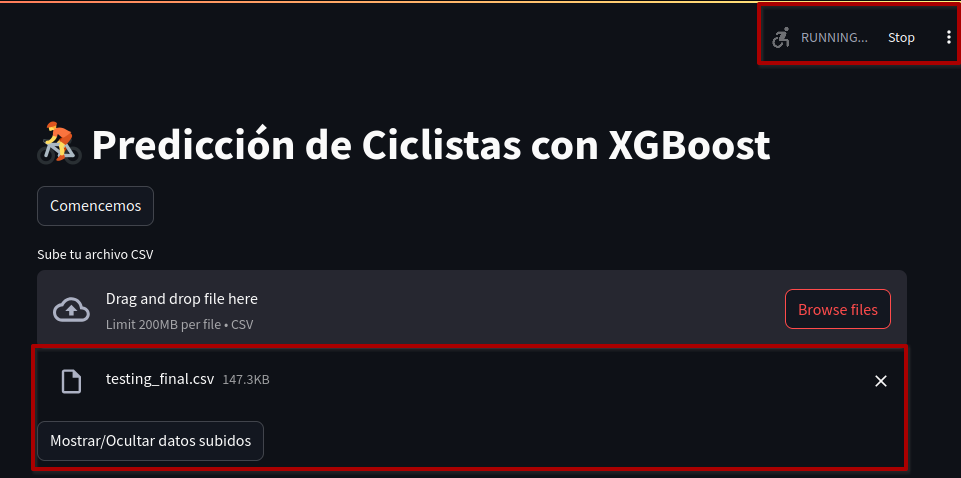

# Predicción de Ciclistas con XGBoost 🚴

## Introducción

El ciclismo ha visto un notable aumento en popularidad a nivel mundial. Actualmente, se estima que hay 1.000 millones de bicicletas en uso en todo el mundo. En China, por ejemplo, hay una flota de aproximadamente 400 millones de bicicletas, destacando la importancia de este medio de transporte.

Aplicaciones como Strava han contribuido significativamente a este fenómeno, con más de 10 mil millones de actividades compartidas y usuarios en 190 países. Este interés en el ciclismo y en el rendimiento personal ha llevado al desarrollo de herramientas avanzadas para registrar y analizar actividades.

## Acerca de la Aplicación

Esta aplicación utiliza el modelo XGBoost para clasificar el rendimiento de ciclistas en cuatro categorías: **Casual**, **Amateur**, **Experimentado** y **Élite**. Basado en datos como edad, género, actividades y diversas métricas de rendimiento, el modelo predice el nivel de cada ciclista.

## Características

- **Carga de Datos**: Los usuarios pueden subir un archivo CSV con sus datos de rendimiento.
- **Predicción de Rendimiento**: La aplicación clasifica automáticamente el rendimiento del ciclista.
- **Visualización de Resultados**: Muestra gráficos interactivos y estadísticas descriptivas de las predicciones.

## Requisitos de los Datos

- Formato: CSV con codificación UTF-8
- Separador: Coma
- Características: `age`, `gender`, `activities`, `weightkg`, `frecuencia_semanal`, `workout_time`, `total_distance`, `elevation_gain`, `average_speed`, `average_power`, `average_hr`

## Uso

1. Sube tu archivo CSV con los datos requeridos.
2. Observa las predicciones y descarga los resultados.
3. Explora estadísticas detalladas y gráficos interactivos.

## Ejemplo de Predicción

Una vez que se sube el archivo CSV, el modelo procesará los datos y clasificará a los ciclistas en una de las cuatro categorías de rendimiento. Puedes descargar los resultados y ver las estadísticas para un análisis más profundo.

## Página en funcionamiento

Aqui ejemplos de como se ve la página a la hora de desplegarla en la nube con Streamlit.

## Contribución y Desarrollo

Este proyecto está abierto a contribuciones. Si tienes alguna mejora o idea, no dudes en hacer un pull request o abrir un issue.

---
